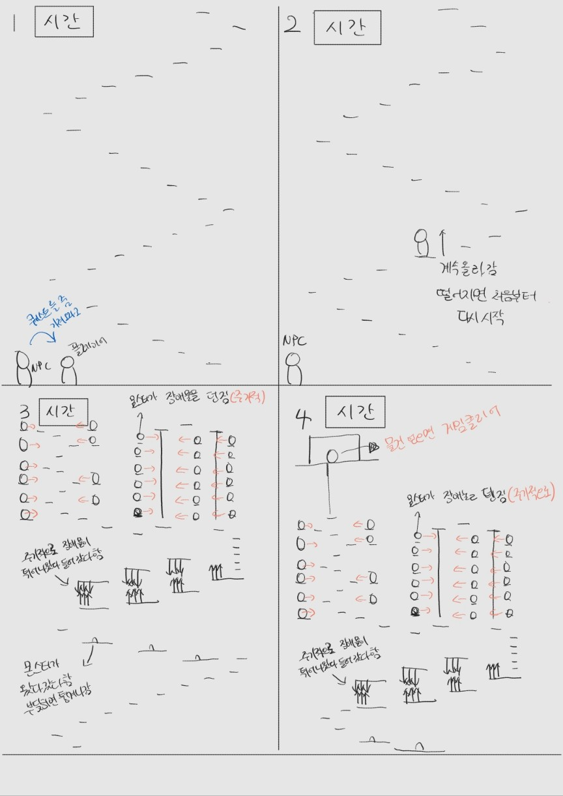

# 2019132005_2DGP
2024 2DGame_Programming_Project

# 인내의 숲 (Forest of Patience)

## 게임 소개
"인내의 숲"은 빠른 반응 속도와 정확한 타이밍이 요구되는 아케이드 게임입니다. 
플레이어는 주어진 캐릭터를 조작해 끊임없이 이어지는 계단을 올라가며 최대한 멀리 이동하는 것이 목표입니다. 
끊임없이 쫓아오는 몬스터로부터 탈출하기 위해 더욱 긴장감 넘치는 플레이가 필요합니다.
**본 게임은 무한의 계단의 오리지널 버전에서 영감을 받았습니다.**

## 게임 컨셉 및 핵심 메카닉
- **컨셉**: 끊임없이 변화하는 계단을 오르며, 빠른 판단과 반응이 요구되는 아케이드 게임
- **핵심 메카닉**:
    - 좌우 방향키 또는 마우스를 사용해 캐릭터가 계단을 오르도록 좆ㄱ.
    - 방향을 잘못 선택할 경우 게임이 즉시 종료.
    - 시간이 지날수록 계단의 속도가 빨라지며 난이도가 상승.
    - 몬스터가 밑에서 쫓아오며, 점점 더 빠르게 다가옴.

## 스크린샷
- 메인화면
  

- 예상 인게임 화면
  

## 예상 게임 실행 흐름
1. **게임 시작**: "시작" 버튼 또는 명령어를 입력하여 게임을 시작합니다.
2. **계단 오르기**: 캐릭터가 계단을 오르며, 플레이어는 좌우 방향키 또는 마우스로 방향을 조정합니다.
3. **점수 시스템**: 발판 1개당 1점이며, 특별한 발판에서 5점 또는 10점을 얻을 수 있습니다..
4. **속도 증가**: 일정 시간이 지나면 계단의 속도가 증가합니다다.
5. **장애물**: 밑에서 몬스터가 쫓아오고 있고 시간이 지날수록 점점 빨리 쫓아옵니다.
6. **게임 종료**: 계단에서 떨어지거나 잘못된 방향으로 움직이면 게임이 종료됩니다.
7. **결과 확인**: 최고 기록을 확인할 수 있습니다.

- 게임 실행 흐름

  
## 개발 내용

### Scene 구성
- **Main Scene**: 텍스트 기반의 게임 시작 메뉴와 옵션 화면을 제공합니다.
- **Game Scene**: 실제 게임이 진행되는 장면입니다. 계단과 캐릭터, UI 요소들이 포함됩니다.

### GameObject
- 게임 에셋과 스프라이트 시트는 메이플스토리라는 ip를 사용해보려고 합니다.
- **계단**: 지속적으로 변화하는 계단 요소 (텍스트나 간단한 그래픽 사용).
- **캐릭터**: 플레이어가 조작하는 캐릭터로, 계단을 오르는 주체 (메이플 게임 캐릭터로 표현).
- **UI 요소**: 점수, 남은 시간 등을 표시하는 텍스트 UI.

### 클래스 구조
- **GameManager**: 게임의 전체 흐름을 관리하는 클래스.
- **PlayerController**: 캐릭터의 움직임을 제어하는 클래스.
- **StairController**: 계단의 생성 및 이동을 담당하는 클래스.
- **UIManager**: 게임 내 점수와 시간을 표시하는 텍스트 UI를 관리하는 클래스.

### 사용한 개발 기법
- **프레임워크**: Python의 pico2d,pygame를 사용해 그래픽과 이벤트 처리를 구현합니다.
- **Input System**: 키보드 및 마우스 입력을 처리하여 캐릭터를 제어합니다.

## 일정
- **10/28 이전 준비 사항**:
    - 게임 기획 및 컨셉 확정.
    - 추가 계획 고안. 
- **개발 계획 (10/28 ~ 7주)**:
    - 1주차: 기본적인 캐릭터 이동 및 계단 오르기 구현. 
    - 2주차: 계단 생성 및 속도 증가 시스템 구현.
    - 3주차: 캐릭터 애니메이션 추가 및 UI 구성.
    - 4주차: 게임 종료 및 점수 시스템 구현.
    - 5주차: 사운드 추가 및 버그 수정.
    - 6주차: 추가 난이도 조정 및 최종 테스트.
    - 7주차: 발표 준비 및 최종 디버깅.

## 진행 상황 및 어려운 부분
- 현재 게임 기획과 컨셉이 확정되었으며, 기본적인 캐릭터 이동과 계단 오르기 기능 구현을 계획 중에 있습니다.
- 캐릭터 이동과 계단 생성을 동시에 처리하는 로직에서 어려움을 겪고 있으며, 특히 계단의 속도 증가와 몬스터 추격 메커니즘을 어떻게 자연스럽게 연동할지에 대한 고민이 있습니다.
- 또한 리소스 선택 및 애니메이션을 적절하게 적용하는 과정에서 이미지 화질과 성능 최적화 문제가 발생할 가능성이 있어 이를 해결하기 위한 방안을 찾고 있습니다.
- 
## Resource 평가
- 이미지와 사운드는 메이플스토리 게임에서 사용되는 이미지와 사운드를 구해보고자 합니다. 문제가 발생할 경우 무료로 배포하는 이미지와 사운드를 사용할 예정입니다.
- 사운드의 경우 여러 브금을 사용하여 처음엔 평화로운 음악에서 게임 진행이 빨라질수록 경쾌한 음악을 사용하려고 합니다.
  
## 추가 계획
- 고퀄리티 캐릭터 애니메이션과 배경 음악을 추가하여 게임의 완성도를 높일 계획입니다.
- 무한의 계단 대신 실제 메이플스토리의 미니게임 중 하나로, 캐릭터의 조작 능력을 테스트하는 플랫폼 게임 인내의 숲을 만들어볼까 생각중입니다. 
