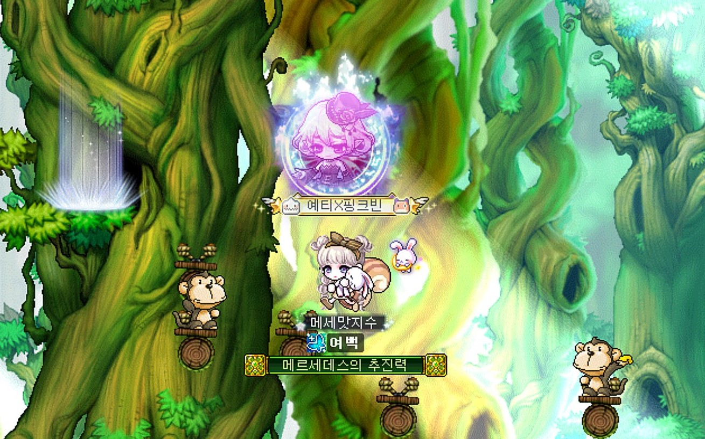

# 2019132005_2DGP
2024 2DGame_Programming_Project
# 3차 최종 발표 영상 링크
https://youtu.be/ZR67mN7gJS0

# 인내의 숲 (Forest of Patience)

## 게임 소개
"인내의 숲"은 메이플스토리의 미니게임에서 영감을 받은 게임으로, 플레이어가 NPC로부터 주어진 퀘스트를 완수하는 것을 목표로 합니다.  
플레이어는 시작 지점에서 NPC에게서 퀘스트를 받고, 맵 꼭대기에 있는 **핑크 안시리움**을 회수해 NPC에게 돌아가야 합니다.  
중간에 다양한 장애물과 몬스터가 배치되어 있으며, 이를 피해 아이템을 회수해야 합니다.

## 게임 컨셉 및 핵심 메카닉
- **컨셉**: 플레이어가 NPC로부터 받은 퀘스트를 완료하기 위해 장애물을 피하며 아이템을 회수하는 플랫폼형 게임.
- **핵심 메카닉**:
  - 좌우 방향키 또는 마우스를 사용해 캐릭터를 조작.
  - 맵 곳곳에 몬스터와 쇠창살 장애물이 등장. 부딪히면 캐릭터가 밀려나고 시작 지점으로 돌아갑니다.
  - 게임은 종료되지 않고 계속 플레이가 가능합니다.
  - 핑크 안시리움을 회수하면 게임이 클리어되고, 그때만 시간이 기록됩니다.
  - NPC에게 말을 걸면 게임이 종료되지만, 이 경우 시간은 기록되지 않습니다.

## 스크린샷
- 메인화면  
  

- 예상 인게임 화면  
  

  - 실제로 이렇게 만든다는 것은 아니고 이런 방식의 게임임을 보여주기 위한 예시
    
## 예상 게임 실행 흐름
1. **게임 시작**: "시작" 버튼을 클릭하거나 명령어로 게임을 시작합니다.
2. **퀘스트 수락**: 플레이어는 NPC에게 가서 핑크 안시리움을 회수하라는 퀘스트를 받습니다.
3. **장애물 피하기**: 몬스터와 쇠창살 등 장애물에 부딪히지 않도록 조심하며 맵 꼭대기로 이동합니다. 부딪힐 경우 시작 지점으로 밀려납니다.
4. **아이템 회수**: 맵 꼭대기에 있는 핑크 안시리움을 회수합니다.
5. **시간 기록**: 핑크 안시리움을 NPC에게 가져다주면 게임이 클리어되고 시간이 기록됩니다.
6. **NPC 대화 (게임 종료)**: 중간에 NPC와 대화하면 게임이 종료되지만, 이때는 시간 기록이 되지 않습니다.

- 게임 실행 흐름(예시)

  
## 개발 내용

### Scene 구성
- **Main Scene**: 게임 시작 메뉴와 옵션 화면.
- **Game Scene**: 캐릭터, 장애물, UI 요소들이 포함된 실제 게임 플레이 화면.

### GameObject
- **NPC**: 게임 시작 지점에 있는 캐릭터로, 플레이어에게 퀘스트를 줍니다.
- **몬스터**: 부딪히면 캐릭터를 밀어내는 장애물.
- **쇠창살 장애물**: 부딪히면 캐릭터를 밀어내는 또 다른 장애물.
- **핑크 안시리움**: 게임 클리어를 위한 목표 아이템.
- **UI 요소**: 게임 시간과 퀘스트 상태를 표시하는 텍스트 UI.

### 클래스 구조
- **GameManager**: 게임의 흐름을 관리.
- **PlayerController**: 캐릭터의 움직임을 제어.
- **ObstacleController**: 장애물의 생성과 움직임을 담당.
- **NPCController**: NPC와의 대화 및 퀘스트 수락 기능을 담당.
- **UIManager**: 게임 내 시간과 퀘스트 상태를 표시하는 UI를 관리.

### 사용한 개발 기법
- **프레임워크**: Python의 pico2d, pygame을 사용해 그래픽과 이벤트 처리를 구현.
- **Input System**: 키보드 및 마우스 입력을 처리하여 캐릭터를 제어.

## 일정

- **10/28 이전 준비 사항**:
    - 게임 기획 및 컨셉 확정.
    - 추가 계획 고안.
- **개발 계획 (10/28 ~ 7주)**:
    - 1주차: 기본적인 캐릭터 이동 및 장애물 피하기 구현.
    - 2주차: 장애물 생성 및 이동 시스템 구현.
    - 3주차: NPC 대화 및 퀘스트 수락 시스템 구현.
    - 4주차: 핑크 안시리움 회수 시스템 및 게임 종료 구현.
    - 5주차: 사운드 추가 및 버그 수정.
    - 6주차: 난이도 조정 및 최종 테스트.
    - 7주차: 발표 준비 및 최종 디버깅.

## 진행 상황 및 어려운 부분
- 캐릭터와 장애물 간의 충돌 처리 및 밀려나는 로직을 자연스럽게 연결하는 부분에서 어려움을 겪고 있습니다.
- 시작 지점으로 돌아가는 로직과 퀘스트 완료 시 시간을 기록하는 부분을 구현 중에 있습니다.
- 리소스 선택과 애니메이션 적용에서 성능 최적화 문제를 고민하고 있습니다.

## Resource 평가
- 이미지와 사운드는 메이플스토리의 이미지를 참고할 예정이며, 필요 시 무료 리소스를 사용할 계획입니다.
- 사운드는 게임의 긴장감을 높이기 위해 플레이 상황에 맞춰 변화를 주려고 합니다.

## 추가 계획
- 퀘스트와 시간을 기록하는 시스템을 완성한 후, 애니메이션과 배경음악을 추가하여 게임의 완성도를 높일 계획입니다.

