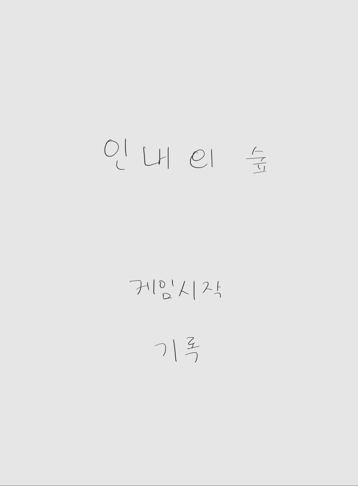
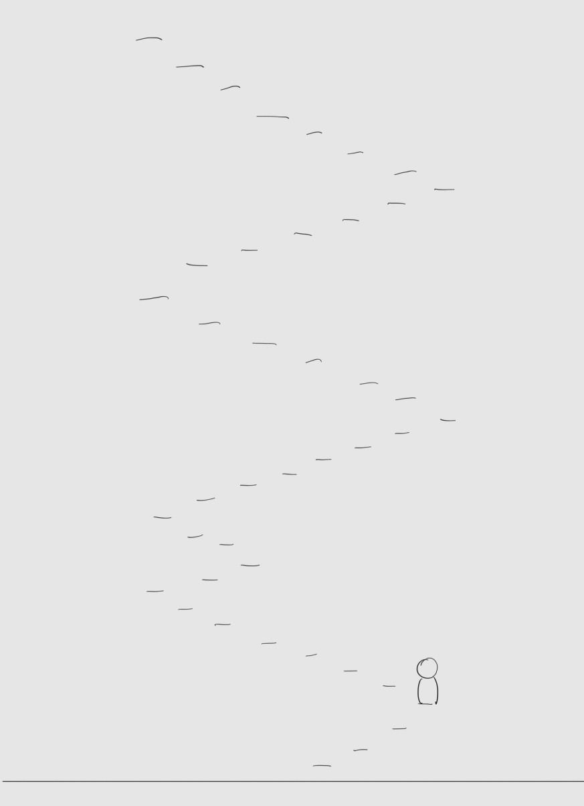

# 2019132005_2DGP
2024 2DGame_Programming

# 인내의 숲 게임

## 게임 소개
"인내의 숲"은 빠른 반응 속도와 정확한 타이밍이 요구되는 아케이드 게임입니다. 
플레이어는 주어진 캐릭터를 조작해 끊임없이 이어지는 계단을 올라가며 최대한 멀리 이동하는 것이 목표입니다. 
밑에서 몬스터가 쫓아오기에 빠르게 계단을 올라가야 하기에 난이도가 점점 올라갑니다.
**본 게임은 무한의 계단의 오리지널 버전에서 영감을 받았습니다.**

## 게임 컨셉 및 핵심 메카닉
- **컨셉**: 끊임없이 변화하는 계단을 오르며, 캐릭터를 조작하여 끝없이 도전하는 아케이드 스타일의 게임.
- **핵심 메카닉**:
    - 좌우 방향키 또는 마우스를 사용해 계단을 오릅니다.
    - 잘못된 방향으로 움직이면 게임이 종료됩니다.
    - 점차 속도가 빨라지며 난이도가 올라갑니다.
    - 캐릭터가 계단에서 떨어지지 않도록 빠르고 정확하게 방향을 바꿔야 합니다.

## 스크린샷
- 메인화면
  

- 예상 인게임 화면
  

## 예상 게임 실행 흐름
1. **게임 시작**: "시작" 버튼 또는 명령어를 입력하여 게임을 시작합니다.
2. **계단 오르기**: 캐릭터가 계단을 오르며, 플레이어는 좌우 방향키 또는 마우스로 방향을 조정합니다.
3. **점수 시스템**: 발판 1개당 1점이며, 확률적으로 5,10점 발판이 나옵니다.
4. **속도 증가**: 일정 시간이 지나면 계단의 속도가 증가하며 난이도가 상승합니다.
5. **장애물**: 밑에서 몬스터가 쫓아오고 있고 시간이 지날수록 점점 빨리 쫓아옵니다.
6. **게임 종료**: 계단에서 떨어지거나 잘못된 방향으로 움직이면 게임이 종료됩니다.
7. **결과 확인**: 최고 기록을 확인할 수 있습니다.

- 게임 실행 흐름

  
## 개발 내용

### Scene 구성
- **Main Scene**: 텍스트 기반의 게임 시작 메뉴와 옵션 화면을 제공합니다.
- **Game Scene**: 실제 게임이 진행되는 장면입니다. 계단과 캐릭터, UI 요소들이 포함됩니다.

### GameObject
- 게임 에셋과 스프라이트 시트는 메이플스토리라는 게임에서 가져올 예정입니다.
- **계단**: 지속적으로 변화하는 계단 요소 (텍스트나 간단한 그래픽으로 표현).
- **캐릭터**: 플레이어가 조작하는 캐릭터로, 계단을 오르는 주체 (메이플 게임 캐릭터로 표현).
- **UI 요소**: 점수, 남은 시간 등을 표시하는 텍스트 UI.

### 클래스 구조
- **GameManager**: 게임의 전체 흐름을 관리하는 클래스.
- **PlayerController**: 캐릭터의 움직임을 제어하는 클래스.
- **StairController**: 계단의 생성 및 이동을 담당하는 클래스.
- **UIManager**: 게임 내 점수와 시간을 표시하는 텍스트 UI를 관리하는 클래스.

### 사용한 개발 기법
- **프레임워크**: Python의 pico2d,pygame를 사용해 그래픽과 이벤트 처리를 구현합니다.
- **Input System**: 키보드 및 마우스 입력을 처리하여 캐릭터를 제어합니다.

## 일정
- **10/28 이전 준비 사항**:
    - 게임 기획 및 컨셉 확정.
    - 기본적인 캐릭터 이동 및 계단 오르기 구현.
- **개발 계획 (10/28 ~ 7주)**:
    - 1주차: 계단 생성 및 속도 증가 시스템 구현.
    - 2주차: 캐릭터 애니메이션 추가 및 UI 구성.
    - 3주차: 게임 종료 및 점수 시스템 구현.
    - 4주차: 사운드 추가 및 버그 수정.
    - 5주차: 추가 난이도 조정 및 최종 테스트.
    - 6~7주차: 발표 준비 및 최종 디버깅.

## 진행 상황 및 어려운 부분
- 아직까진 계획 구상단게에선 없습니다.

## Resource 평가
- 이미지와 사운드는 메이플스토리 게임에서 사용되는 이미지와 사운드를 구해보고자 합니다. 안될 경 무료로 배포하는 이미지와 사운드를 사용할 예정입니다.
- 사운드의 경우 여러 브금을 사용하여 처음엔 평화로운 음악에서 게임 진행이 빨라질수록 경쾌한 음악을 사용하려고 합니다.
- 이미지와 리소스의 화질이 안좋고 제대로 동작하지 않을경우 포맷 변환이나 리소스 통합 등 추가 공부를 통해 해결하고자 합니다.
- 더 많은 캐릭터 애니메이션과 배경 음악을 추가하여 게임의 완성도를 높일 계획입니다.
